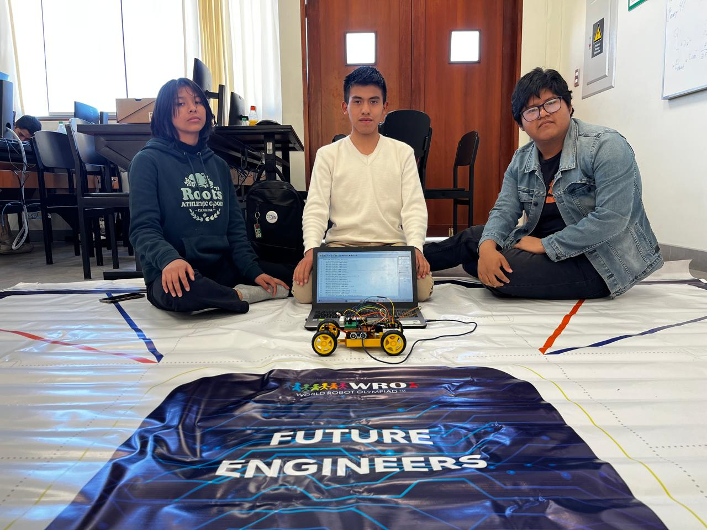

<!DOCTYPE html>
<html lang="en">
<head>
    <meta charset="UTF-8">
    <meta name="viewport" content="width=device-width, initial-scale=1.0">
</head>
<body>
    <h1>TUMI-AQP WRO 2024</h1>
    <h3>Repository for TUMI-AQP WRO Future Engineers</h3>
   
</body>
</html>

# Equipo WRO 2024 - Futuros Ingenieros

# Equipo WRO 2024 - Futuros Ingenieros

| **Nombre**                        | **Rol**                                      | **Descripción**                                                               |
|-----------------------------------|----------------------------------------------|--------------------------------------------------------------------------------|
| **Joshua Huillca Fuentes**        | **Estratega y Analista Técnico**             | **El cerebro estratégico que siempre encuentra la mejor solución.**            |
| **Lucy Pérez Casazola**           | **Creativa y Diseñadora Técnica**            | **La mente creativa que da vida a nuestros diseños innovadores.**              |
| **Gabriel Palomino Mendoza**      | **Electrónica, Programación y Optimización** | **Especialista en electrónica y optimización de sistemas complejos.**          |
| **Cristian Villca Balcón**        | **Mentor**                                   | **Experto en robótica que nos guía con su vasta experiencia.**                 |
| **Edgard Layme Carpio**           | **Mentor**                                   | **Especialista en sistemas y automatización que refuerza nuestras habilidades.**|

> [!ELECTRONICS]
> In order to choose the apropiate materials, we made a design and a table of components with all our options. Then, we selected the ones that seemed the most efficient to us.

> 🛠️ **TIP:**  
> In order to choose the appropriate materials, we made a design and a table of components with all our options. Then, we selected the ones that seemed the most efficient to us.
